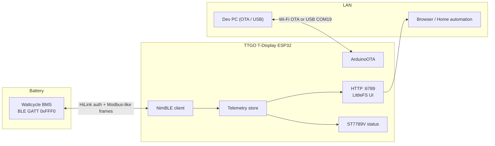
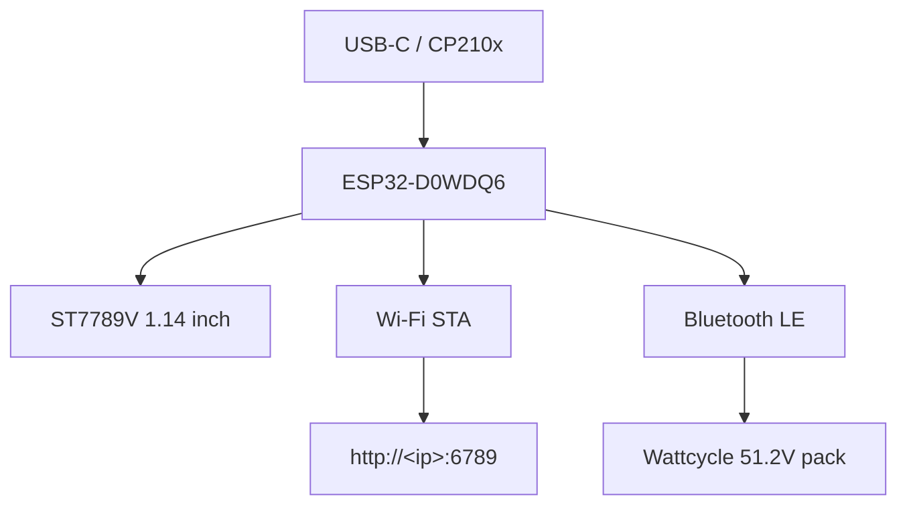
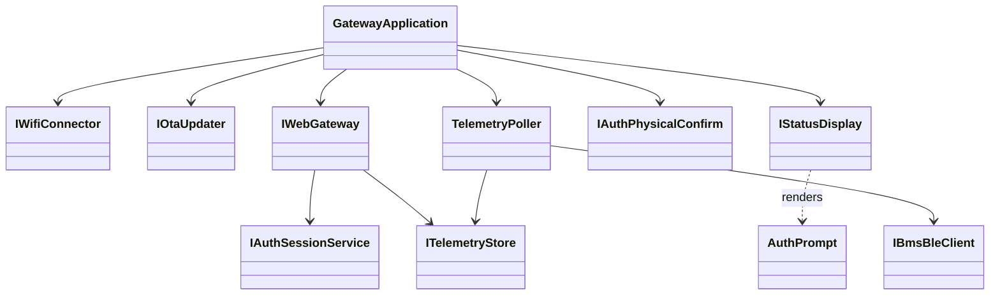

# Wattcycle ESP32 Gateway

> Turn a **LILYGO TTGO T-Display** into a local **BLE → Wi-Fi** bridge for a
> Wattcycle / XDZN **51.2 V** smart BMS — then browse live telemetry on your LAN.

[](https://platformio.org/)
[](https://github.com/qume/wattcycle_ble)
[](#quick-start)

---

## Why this exists

Wattcycle packs expose rich BMS data over **Bluetooth**, but they do **not** ship a
routable web server. Phones work locally; remote / LAN dashboards do not.

This project makes the ESP32 a **small always-on gateway**:



**No SD card required** — the dashboard (`data/`) is flashed into **LittleFS** on the ESP.

---

## Hardware (probed)

| Item | Value |
|------|-------|
| Board | LILYGO TTGO T-Display |
| MCU | **ESP32-D0WDQ6** rev v1.0 *(classic ESP32 — not S3)* |
| Flash | 4 MB |
| Radio | Wi-Fi + Bluetooth (dual core @ 240 MHz) |
| Display | 1.14″ IPS **ST7789V** (135×240) |
| USB-UART | Silicon Labs CP210x |
| Probed port | **COM19** |
| MAC (example unit) | `24:6F:28:25:18:14` |

### ESP TTGO used on this project as the bluetooth-wifi gateway + display

<p align="center">
  
</p>

### Display pinout

<p align="center">
  
</p>

| Signal | GPIO |
|--------|------|
| MOSI | 19 |
| SCLK | 18 |
| CS | 5 |
| DC | 16 |
| RST | 23 |
| Backlight | 4 |



---

## BLE protocol (short version)

Based on the excellent reverse engineering in
[`qume/wattcycle_ble`](https://github.com/qume/wattcycle_ble):

| Step | Detail |
|------|--------|
| Discover | Names starting with `XDZN` or `WT` |
| Service | `0xFFF0` |
| Notify / Write / Auth | `FFF1` / `FFF2` / `FFFA` |
| Auth | Write ASCII `HiLink` to `FFFA` (no pairing) |
| Framing | Head `0x7E` (or `0x1E`) … Modbus CRC16 … tail `0x0D` |
| Main DP | Analog Quantity **140** (`0x8C`) — SoC, V, I, cells, temps… |

---

## Repository layout (domain folders)

```text
src/
  CompositionRoot/   # DI wiring only
  Config/            # Build-flag / env configuration
  Bms/
    Models/          # BatteryTelemetry, warnings, product info
    Protocol/        # CRC, frames, parsers (unit-tested)
    Ble/             # NimBLE adapter
  Telemetry/         # Store, poller, binary codec, gateway status
  Auth/              # NVS credentials, RAM sessions, physical confirm (ISP-split)
  Wifi/  Ota/  Web/  Display/  Esp/  Util/
web/                 # SPA sources (bundled → data/ LittleFS)
scripts/             # run_tests / flash_usb / flash_ota / guardrails / bundle_web
test/                # PlatformIO native Unity tests
```

Design goals: **SOLID**, constructor injection, files **&lt; 400 lines**, classes **&lt; 30 methods**, **no nested classes**.

---

## Quick Start

### 0. Prerequisites

- [PlatformIO Core](https://platformio.org/install/cli) (`pio` on PATH)
- PowerShell 5+ / 7+
- ESP32 on USB (**COM19** by default)
- Environment variables (**required**, never commit secrets):

```powershell
$env:WIFI_SSID = "YourWifiName"
$env:WIFI_PASS = "YourWifiPassword"
$env:BMS_BLE_ADDRESS = "AA:BB:CC:DD:EE:FF"   # BLE MAC only — no serial / password needed
```

> **BMS connection:** only the BLE MAC (`BMS_BLE_ADDRESS`) is required. Auth uses the fixed Wattcycle `HiLink` key over GATT (no pairing, no serial number). Find the MAC in the phone app or any BLE scanner (`XDZN…` / `WT…` names).

> Tip: leave `BMS_BLE_ADDRESS` unset only while bringing Wi-Fi/UI up; BLE polling will report a clear error on the display and `/api/telemetry.bin`.

### 1. Run unit tests + guardrails

```powershell
.\scripts\run_tests.ps1
```

### 2. First flash (USB)

```powershell
.\scripts\flash_usb.ps1 -Port COM19
```

This uploads firmware **and** the LittleFS web assets.

### 3. Open the dashboard

1. Read the IP on the TTGO screen (or Serial @ 115200 baud).
2. Browse to:

```text
http://<esp-ip>:6789/
```

Binary telemetry API (decoded in the browser; **requires login session cookie**):

```text
http://<esp-ip>:6789/api/telemetry.bin
```

### Web authentication

- First visit with empty NVS: browser asks for username/password → ESP screen asks for **physical confirm** (**TOP / GPIO35 = OK**, **BOTTOM / GPIO0 = Cancel**).
- Username ≤32 `[A-Za-z0-9._-]`; password 8–64 printable ASCII. Auth JSON bodies capped at 512 bytes (overflow / injection hardening).
- After credentials are stored (salted SHA-256 in NVS `wg_auth`), the SPA stays on the login screen until `/api/auth/login` succeeds. Telemetry is rejected with **401** without a valid `wg_session` cookie (`HttpOnly; SameSite=Strict`).
- Forgot password / Account tab: hold **BOTTOM (GPIO0) for 3 seconds** → confirm clear on TOP. Then recreate credentials. Use **Account** to sign out.
- Threat model: HTTP on LAN + local password. Sessions are RAM-only (re-login after reboot). Do **not** expose port 6789 to the public internet.
- **HTTPS note:** on this classic ESP32 + NimBLE stack, in-process TLS (`esp32_https_server` / OpenSSL) freezes the device under load — HTTP is intentional until a lighter TLS path exists.

Web sources live in `web/` (HTML views + CSS + JS modules). `scripts/bundle_web.ps1` packs them into `data/` before LittleFS upload (ETag caching on static assets). The `data/` folder is gitignored — regenerate with the bundle script / PlatformIO pre-script.

TTGO buttons: **GPIO0 (bottom)** = previous page / Cancel; **GPIO35 (top)** = next page / Validate. No touchscreen. Backlight sleeps after **60 s** without input; the display UI task is suspended while asleep and resumes on the next button press (wake only, no page change). Gateway/overview show **`ip:port`** for the web UI.

### Web UI screenshots

Each image matches one dashboard tab (same order as the SPA nav).

<table>
  <tr>
    <td align="center" width="50%">
      <p><strong>Overview</strong></p>
      
    </td>
    <td align="center" width="50%">
      <p><strong>Cells</strong></p>
      
    </td>
  </tr>
  <tr>
    <td align="center" width="50%">
      <p><strong>Temps</strong></p>
      
    </td>
    <td align="center" width="50%">
      <p><strong>Alerts</strong></p>
      
    </td>
  </tr>
  <tr>
    <td align="center" width="50%">
      <p><strong>Gateway</strong></p>
      
    </td>
    <td align="center" width="50%">
      <p><strong>ESP</strong></p>
      
    </td>
  </tr>
  <tr>
    <td align="center" colspan="2">
      <p><strong>Account</strong></p>
      
    </td>
  </tr>
</table>

### 4. Later updates over the air

```powershell
.\scripts\flash_ota.ps1 -Hostname wattcycle-gateway
# or, if mDNS is flaky on Windows:
.\scripts\flash_ota.ps1 -Ip 192.168.x.y
```

### Manual PlatformIO commands

```powershell
pio test -e native
pio run -e ttgo-tdisplay
pio run -e ttgo-tdisplay -t upload --upload-port COM19
pio run -e ttgo-tdisplay -t uploadfs --upload-port COM19
pio device monitor -p COM19 -b 115200
```

---

## Configuration reference

| Variable / flag | Purpose |
|-----------------|---------|
| `WIFI_SSID` / `WIFI_PASS` | Station credentials (build-time inject) |
| `BMS_BLE_ADDRESS` | Target BMS MAC `AA:BB:CC:DD:EE:FF` |
| `WEB_SERVER_PORT` | Default **6789** |
| `BMS_POLL_INTERVAL_MS` | Default **2000** (UI refresh matches) |
| `OTA_HOSTNAME` | Default `wattcycle-gateway` |

---

## Architecture notes



`src/main.cpp` constructs concrete adapters and injects them into `GatewayApplication` (interfaces only); auth `begin()` runs in `main` before the composition root.
Auth is ISP-split: `EspWebGateway` depends on `IAuthSessionService` (login/setup start only — physical confirm/reset stay private on `AuthService`); display/buttons use `IAuthPhysicalConfirm` + shared `auth::AuthPrompt`.
Browser chart history is **localStorage only** (up to 24 h, ephemeral per device) — not stored on the ESP.
`scripts/check_guardrails.ps1` fails if files grow past limits or concrete adapter headers leak outside `main.cpp` / their domain.

---

## Credits & references

- Protocol: [qume/wattcycle_ble](https://github.com/qume/wattcycle_ble)
- Related ecosystem: ioBroker.wattcycle, dbus-serialbattery XDZN BLE driver discussions
- Display: LILYGO TTGO T-Display / ST7789V community pinouts

---

## License

See [LICENSE](LICENSE).
