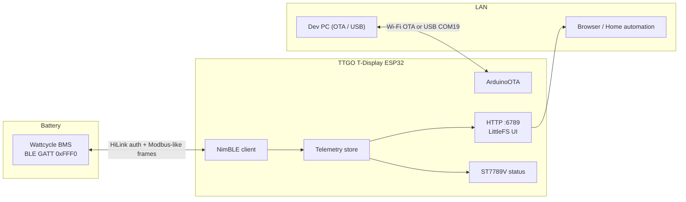
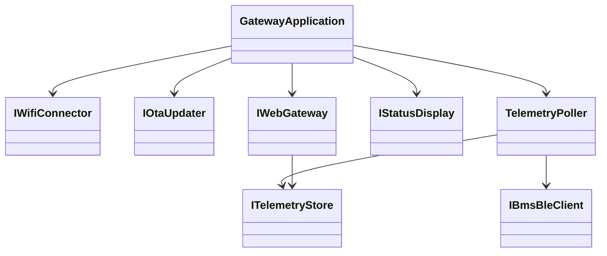

# Wattcycle ESP32 Gateway

> Turn a **LILYGO TTGO T-Display** into a local **BLE → Wi-Fi** bridge for a
> Wattcycle / XDZN **51.2 V** smart BMS — then browse live telemetry on your LAN.

[](https://platformio.org/)
[](https://github.com/qume/wattcycle_ble)
[](#quick-start)

---

## Why this exists

Wattcycle packs expose rich BMS data over **Bluetooth**, but they do **not** ship a
routable web server. Phones work locally; remote / LAN dashboards do not.

This project makes the ESP32 a **small always-on gateway**:



**No SD card required** — the dashboard (`data/`) is flashed into **LittleFS** on the ESP.

---

## Hardware (probed)

| Item | Value |
|------|-------|
| Board | LILYGO TTGO T-Display |
| MCU | **ESP32-D0WDQ6** rev v1.0 *(classic ESP32 — not S3)* |
| Flash | 4 MB |
| Radio | Wi-Fi + Bluetooth (dual core @ 240 MHz) |
| Display | 1.14″ IPS **ST7789V** (135×240) |
| USB-UART | Silicon Labs CP210x |
| Probed port | **COM19** |
| MAC (example unit) | `24:6F:28:25:18:14` |

### Display pinout (from `Resources/Esp32-TTGO_Pinout.png`)

| Signal | GPIO |
|--------|------|
| MOSI | 19 |
| SCLK | 18 |
| CS | 5 |
| DC | 16 |
| RST | 23 |
| Backlight | 4 |

```mermaid
flowchart TB
  USB["USB-C / CP210x"] --> ESP["ESP32-D0WDQ6"]
  ESP --> TFT["ST7789V 1.14\""]
  ESP --> WIFI["Wi-Fi STA"]
  ESP --> BT["Bluetooth LE"]
  BT --> PACK["Wattcycle 51.2V pack"]
  WIFI --> UI["http://&lt;ip&gt;:6789"]
```

---

## BLE protocol (short version)

Based on the excellent reverse engineering in
[`qume/wattcycle_ble`](https://github.com/qume/wattcycle_ble):

| Step | Detail |
|------|--------|
| Discover | Names starting with `XDZN` or `WT` |
| Service | `0xFFF0` |
| Notify / Write / Auth | `FFF1` / `FFF2` / `FFFA` |
| Auth | Write ASCII `HiLink` to `FFFA` (no pairing) |
| Framing | Head `0x7E` (or `0x1E`) … Modbus CRC16 … tail `0x0D` |
| Main DP | Analog Quantity **140** (`0x8C`) — SoC, V, I, cells, temps… |

---

## Repository layout (domain folders)

```text
src/
  CompositionRoot/   # DI wiring only
  Config/            # Build-flag / env configuration
  Bms/
    Models/          # BatteryTelemetry, warnings, product info
    Protocol/        # CRC, frames, parsers (unit-tested)
    Ble/             # NimBLE adapter
  Telemetry/         # Store, poller, JSON serializer
  Wifi/  Ota/  Web/  Display/data/                # LittleFS web UI (index/css/js)
scripts/             # run_tests / flash_usb / flash_ota / guardrails
test/                # PlatformIO native Unity tests
```

Design goals: **SOLID**, constructor injection, files **&lt; 400 lines**, classes **&lt; 30 methods**, **no nested classes**.

---

## Quick Start

### 0. Prerequisites

- [PlatformIO Core](https://platformio.org/install/cli) (`pio` on PATH)
- PowerShell 5+ / 7+
- ESP32 on USB (**COM19** by default)
- Environment variables (**required**, never commit secrets):

```powershell
$env:WIFI_SSID = "YourWifiName"
$env:WIFI_PASS = "YourWifiPassword"
$env:BMS_BLE_ADDRESS = "AA:BB:CC:DD:EE:FF"   # BLE MAC only — no serial / password needed
```

> **BMS connection:** only the BLE MAC (`BMS_BLE_ADDRESS`) is required. Auth uses the fixed Wattcycle `HiLink` key over GATT (no pairing, no serial number). Find the MAC in the phone app or any BLE scanner (`XDZN…` / `WT…` names).

> Tip: leave `BMS_BLE_ADDRESS` unset only while bringing Wi-Fi/UI up; BLE polling will report a clear error on the display and `/api/telemetry.bin`.

### 1. Run unit tests + guardrails

```powershell
.\scripts\run_tests.ps1
```

### 2. First flash (USB)

```powershell
.\scripts\flash_usb.ps1 -Port COM19
```

This uploads firmware **and** the LittleFS web assets.

### 3. Open the dashboard

1. Read the IP on the TTGO screen (or Serial @ 115200 baud).
2. Browse to:

```text
http://<esp-ip>:6789/
```

Binary telemetry API (decoded in the browser):

```text
http://<esp-ip>:6789/api/telemetry.bin
```

Web sources live in `web/` (HTML views + CSS + JS modules). `scripts/bundle_web.ps1` packs them into `data/` before LittleFS upload (ETag caching on static assets).

### 4. Later updates over the air

```powershell
.\scripts\flash_ota.ps1 -Hostname wattcycle-gateway
# or, if mDNS is flaky on Windows:
.\scripts\flash_ota.ps1 -Ip 192.168.x.y
```

### Manual PlatformIO commands

```powershell
pio test -e native
pio run -e ttgo-tdisplay
pio run -e ttgo-tdisplay -t upload --upload-port COM19
pio run -e ttgo-tdisplay -t uploadfs --upload-port COM19
pio device monitor -p COM19 -b 115200
```

---

## Configuration reference

| Variable / flag | Purpose |
|-----------------|---------|
| `WIFI_SSID` / `WIFI_PASS` | Station credentials (build-time inject) |
| `BMS_BLE_ADDRESS` | Target BMS MAC `AA:BB:CC:DD:EE:FF` |
| `WEB_SERVER_PORT` | Default **6789** |
| `BMS_POLL_INTERVAL_MS` | Default **5000** |
| `OTA_HOSTNAME` | Default `wattcycle-gateway` |

---

## Architecture notes



`src/main.cpp` constructs concrete adapters and injects them into `GatewayApplication` (interfaces only).
`scripts/check_guardrails.ps1` fails if files grow past limits or concrete adapter headers leak outside `main.cpp` / their domain.

---

## Credits & references

- Protocol: [qume/wattcycle_ble](https://github.com/qume/wattcycle_ble)
- Related ecosystem: ioBroker.wattcycle, dbus-serialbattery XDZN BLE driver discussions
- Display: LILYGO TTGO T-Display / ST7789V community pinouts

---

## License

See [LICENSE](LICENSE).
