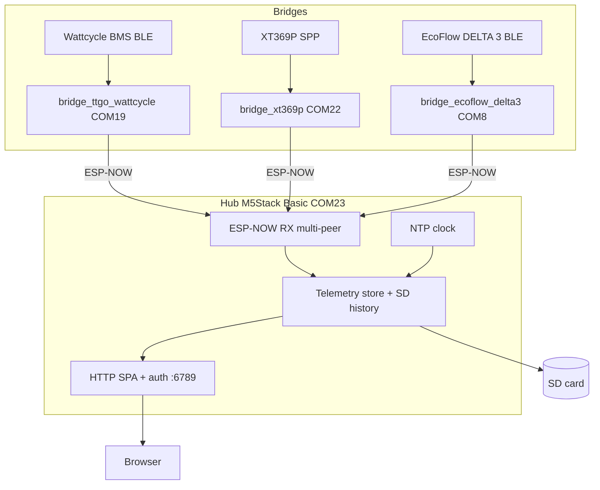
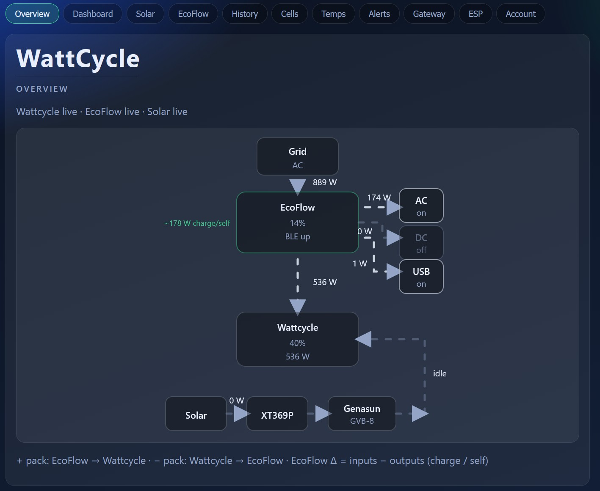
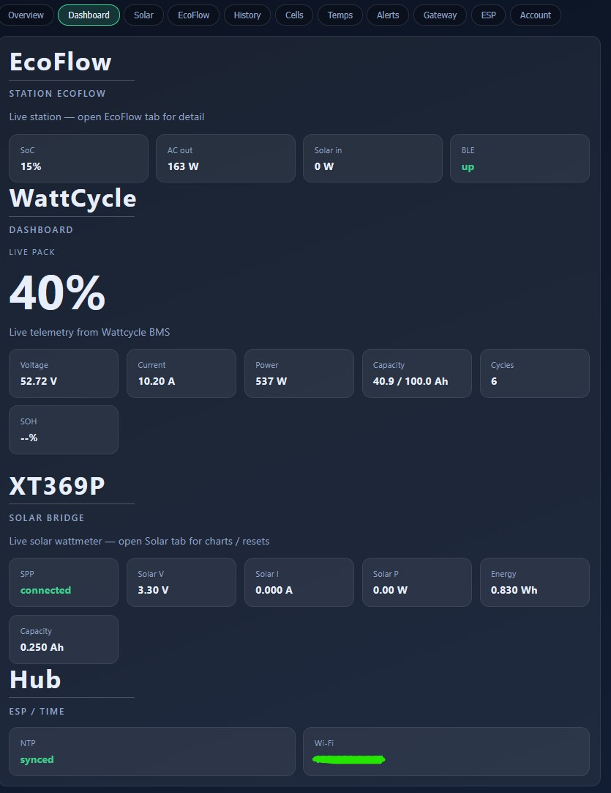
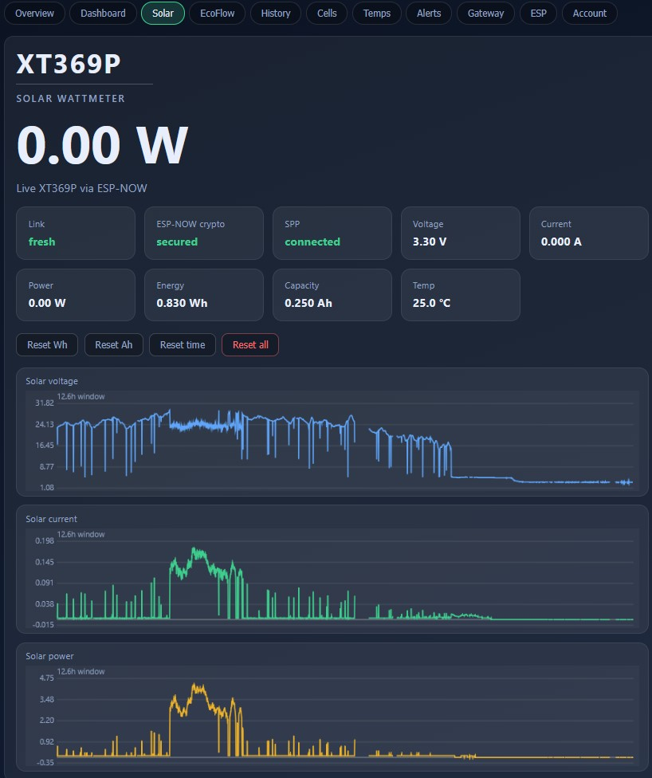
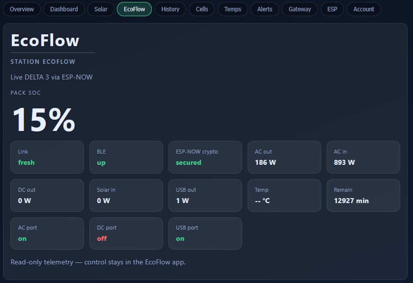
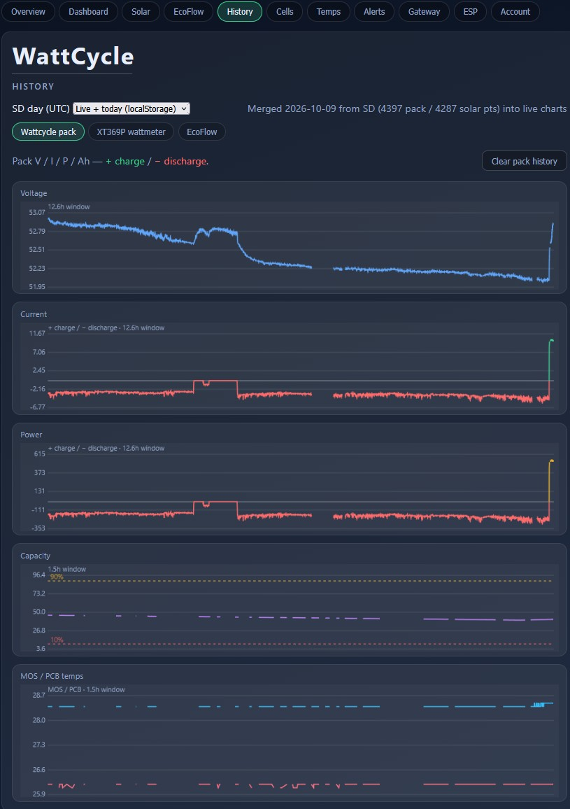
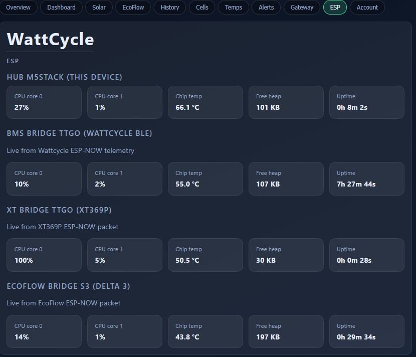
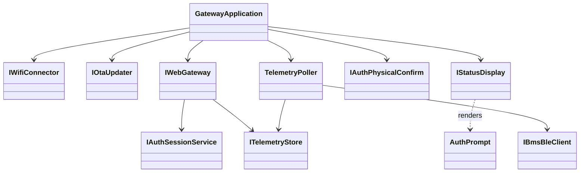

# Wattcycle ESP32 Gateway

> Monorepo: **M5Stack web hub** (Wi‑Fi + ESP-NOW RX) + **bridges**
> (Wattcycle BLE / XT369P SPP / EcoFlow DELTA 3 BLE → ESP-NOW) — one dashboard on the LAN.

[](https://platformio.org/)
[](https://github.com/qume/wattcycle_ble)
[](#quick-start)

---

## Why this exists

Wattcycle packs expose rich BMS data over **Bluetooth**, but they do **not** ship a
routable web server. Phones work locally; remote / LAN dashboards do not. The same
gap applies to the XT369P wattmeter and EcoFlow station apps — this hub aggregates
them on the LAN.

One hub + three bridges, one repo:



Prefer `.\scripts\pair_espnow_link.ps1` for first-time MAC + PMK setup, then
`.\scripts\flash.ps1 -Target All` (includes EcoFlow S3 when `EcoflowBridgePort` is set).

The SPA (`data/`) is flashed into hub **LittleFS**. Optional **SD** on the M5 holds
daily CSV history (`/history/YYYY-MM-DD.csv`, UTC dates).

---

## Hardware

Classic hubs/bridges use **ESP32-D0WDQ6**, 4 MB flash, Silicon Labs CP210x USB-UART.  
The EcoFlow bridge uses an **ESP32-S3** DevKitC (native USB flash + separate USB-UART console).

| Role | Board | Port | Notes |
|------|-------|------|-------|
| Web hub | **M5Stack Basic** | **COM23** | Wi-Fi SPA :6789, multi-peer ESP-NOW RX, optional SD, NTP |
| BMS bridge | LILYGO TTGO T-Display | **COM19** | Wattcycle BLE → ESP-NOW TX (no web) |
| Solar bridge | LILYGO TTGO T-Display | **COM22** | XT369P Classic SPP → ESP-NOW TX (no web) |
| EcoFlow bridge | ESP32-S3 DevKitC | **COM8** | DELTA 3 BLE → ESP-NOW TX (read-only; no web / OTA) |

### TTGO bridge display (ST7789V 1.14″)

<p align="center">
  
</p>

<p align="center">
  
</p>

| Signal | GPIO |
|--------|------|
| MOSI | 19 |
| SCLK | 18 |
| CS | 5 |
| DC | 16 |
| RST | 23 |
| Backlight | 4 |

---

## Protocols

| Device | Doc |
|--------|-----|
| Wattcycle / XDZN BMS (BLE) | [docs/WATTCYCLE_PROTOCOL.md](docs/WATTCYCLE_PROTOCOL.md) · upstream [qume/wattcycle_ble](https://github.com/qume/wattcycle_ble) |
| ATorch XT369P (Classic SPP) | [docs/XT369P_PROTOCOL.md](docs/XT369P_PROTOCOL.md) |
| EcoFlow DELTA 3 (BLE, read-only) | [docs/ECOFLOW_DELTA3_BRIDGE_PLAN.md](docs/ECOFLOW_DELTA3_BRIDGE_PLAN.md) · [GATT/auth protocol](docs/ECOFLOW_BLE_PROTOCOL.md) |

### Wattcycle BLE (short)

| Step | Detail |
|------|--------|
| Discover | Names starting with `XDZN` or `WT` |
| Service | `0xFFF0` |
| Notify / Write / Auth | `FFF1` / `FFF2` / `FFFA` |
| Auth | Write ASCII `HiLink` to `FFFA` (no pairing) |
| Framing | Head `0x7E` (or `0x1E`) … Modbus CRC16 … tail `0x0D` |
| Main DP | Analog Quantity **140** (`0x8C`) — SoC, V, I, cells, temps… |

### XT369P solar meter

<p align="center">
  
</p>

<p align="center">
  
</p>

Classic SPP name `XT369P_SPP` → TTGO `bridge_xt369p` → ESP-NOW → hub. Frame layout and checksum notes are in the protocol doc above.

---

## Repository layout (monorepo)

```text
src/
  common/                 # Util + ESP-NOW protocols (+ shared Bms models)
  hub_common/             # Auth, HttpApi, Ota, Telemetry store, NTP helpers
  hub_m5_wattcycle/       # Web hub (COM23): multi-peer ESP-NOW RX + SD
  bridge_ttgo_wattcycle/  # BMS BLE → ESP-NOW TX (COM19)
  bridge_xt369p/          # XT369P SPP → ESP-NOW TX (COM22)
  bridge_ecoflow_delta3/  # EcoFlow DELTA 3 BLE → ESP-NOW TX (COM8, S3)
  hub_ttgo_wattcycle/     # Optional combined TTGO hub (rollback / single-board)
web/                      # SPA (hub LittleFS only)
docs/                     # protocol notes + EcoFlow bridge plan
scripts/                  # flash.ps1 / pair_espnow_link / run_tests / …
test/                     # native Unity tests (hub parsers)
```

| PlatformIO env | Port | Role |
|----------------|------|------|
| `hub_m5_wattcycle` | COM23 | Web hub + multi-peer ESP-NOW RX + SD/NTP |
| `bridge_ttgo_wattcycle` | COM19 | BMS BLE → ESP-NOW TX |
| `bridge_xt369p` | COM22 | SPP → ESP-NOW TX (no web) |
| `bridge_ecoflow_delta3` | COM8 | EcoFlow DELTA 3 BLE → ESP-NOW TX (S3; USB flash only for now) |
| `hub_ttgo_wattcycle` | COM19 | Optional combined TTGO hub (BLE + web on one board) |
| `native` | — | Host unit tests |

Design goals: **SOLID**, constructor injection, files **&lt; 400 lines**, classes **&lt; 30 methods**, **no nested classes**.

---

## Quick Start

### 0. Prerequisites

- [PlatformIO Core](https://platformio.org/install/cli) (`pio` on PATH)
- PowerShell 5+ / 7+
- M5 hub on USB (**COM23**); BMS bridge **COM19**; XT bridge **COM22**; EcoFlow S3 bridge **COM8**
- Environment variables (**required**, never commit secrets):

```powershell
$env:WIFI_SSID = "YourWifiName"
$env:WIFI_PASS = "YourWifiPassword"          # hub STA join (bridges use SSID for channel only)
$env:BMS_BLE_ADDRESS = "AA:BB:CC:DD:EE:FF"   # on BMS bridge — BLE MAC only
# Optional solar bridge:
# $env:XT369P_BT_ADDRESS = "AA:BB:CC:DD:EE:FF"
# ESPNOW_* set by pair_espnow_link.ps1 (hub peers + shared PMK)
```

> **BMS connection:** only the BLE MAC (`BMS_BLE_ADDRESS` on the BMS bridge) is required. Auth uses the fixed Wattcycle `HiLink` key over GATT (no pairing, no serial number). Find the MAC in the phone app or any BLE scanner (`XDZN…` / `WT…` names).

### 1. Run unit tests + guardrails

```powershell
.\scripts\run_tests.ps1
```

### 2. Flash firmwares (USB)

```powershell
# M5 hub only (firmware + LittleFS)
.\scripts\flash.ps1 -Target HubM5 -Port COM23

# Individual bridges
.\scripts\flash.ps1 -Target BridgeTtgoWattcycle -Port COM19
.\scripts\flash.ps1 -Target BridgeXt369p -Port COM22
.\scripts\flash.ps1 -Target BridgeEcoflowDelta3 -Port COM8

# Hub + BMS + XT + EcoFlow (distinct COM ports)
.\scripts\flash.ps1 -Target All -HubPort COM23 -BmsBridgePort COM19 -XtBridgePort COM22 -EcoflowBridgePort COM8
```

### 2b. Pair ESP-NOW peers

Plug the hub and bridges (including EcoFlow S3), then run the pairing script
(writes `ESPNOW_*` User env vars and can flash):

```powershell
.\scripts\pair_espnow_link.ps1 `
  -HubPort COM23 `
  -BmsBridgePort COM19 `
  -XtBridgePort COM22 `
  -EcoflowBridgePort COM8 `
  -Flash
```

```text
BRIDGES (COM19 / COM22 / COM8)  --ESP-NOW-->  HUB M5 (COM23)

ESPNOW_PEER_MAC               on each BRIDGE = HUB STA MAC
ESPNOW_BMS_BRIDGE_MAC         on HUB         = BMS bridge STA MAC
ESPNOW_BRIDGE_MAC             on HUB         = XT bridge STA MAC
ESPNOW_ECOFLOW_BRIDGE_MAC     on HUB         = EcoFlow S3 bridge STA MAC
ESPNOW_PMK                    on ALL         = same secret
```

### 3. Open the dashboard

1. Read the IP on the M5 screen (or Serial @ 115200 baud).
2. Browse to:

```text
http://<esp-ip>:6789/
```

Binary telemetry API (decoded in the browser; **requires login session cookie**):

```text
http://<esp-ip>:6789/api/telemetry.bin
```

### Web authentication

- First visit with empty NVS: browser asks for username/password → M5 screen asks for **physical confirm** (**Btn B = OK**, **Btn A / C = Cancel** depending on prompt).
- Username ≤32 `[A-Za-z0-9._-]`; password 8–64 printable ASCII. Auth JSON bodies capped at 512 bytes (overflow / injection hardening).
- After credentials are stored (salted SHA-256 in NVS `wg_auth`), the SPA stays on the login screen until `/api/auth/login` succeeds. Telemetry is rejected with **401** without a valid `wg_session` cookie (`HttpOnly; SameSite=Strict`).
- Forgot password / Account tab: follow the on-device reset prompt, then recreate credentials. Use **Account** to sign out.
- Threat model: HTTP on LAN + local password. Sessions are RAM-only (re-login after reboot). Do **not** expose port 6789 to the public internet.
- **HTTPS note:** on this classic ESP32 + NimBLE stack, in-process TLS freezes the device under load — HTTP is intentional until a lighter TLS path exists.

Web sources live in `web/` (HTML views + CSS + JS modules). `scripts/bundle_web.ps1` packs them into `data/` before LittleFS upload (ETag caching on static assets). The `data/` folder is gitignored — regenerate with the bundle script / PlatformIO pre-script.

M5 face buttons: **A** = previous page, **B** = confirm / center, **C** = next page (labeled in the on-screen footer tiles). Backlight sleeps after idle input; the display UI task suspends while asleep and resumes on the next button press (wake only, no page change).

### Web UI screenshots

Each image matches one dashboard tab (**same order as the SPA nav**).

<table>
  <tr>
    <td align="center" width="50%">
      <p><strong>Overview</strong></p>
      
    </td>
    <td align="center" width="50%">
      <p><strong>Dashboard</strong></p>
      
    </td>
  </tr>
  <tr>
    <td align="center" width="50%">
      <p><strong>Solar</strong></p>
      
    </td>
    <td align="center" width="50%">
      <p><strong>EcoFlow</strong></p>
      
    </td>
  </tr>
  <tr>
    <td align="center" width="50%">
      <p><strong>History</strong></p>
      
    </td>
    <td align="center" width="50%">
      <p><strong>Cells</strong></p>
      
    </td>
  </tr>
  <tr>
    <td align="center" width="50%">
      <p><strong>Temps</strong></p>
      
    </td>
    <td align="center" width="50%">
      <p><strong>Alerts</strong></p>
      
    </td>
  </tr>
  <tr>
    <td align="center" width="50%">
      <p><strong>Gateway</strong></p>
      
    </td>
    <td align="center" width="50%">
      <p><strong>ESP</strong></p>
      
    </td>
  </tr>
  <tr>
    <td align="center" colspan="2">
      <p><strong>Account</strong></p>
      
    </td>
  </tr>
</table>

### 4. Later updates over the air

```powershell
.\scripts\flash_ota.ps1 -Hostname wattcycle-gateway
# or, if mDNS is flaky on Windows:
.\scripts\flash_ota.ps1 -Ip 192.168.x.y
```

### Manual PlatformIO commands

```powershell
pio test -e native
pio run -e hub_m5_wattcycle
pio run -e bridge_ttgo_wattcycle
pio run -e bridge_xt369p
pio run -e bridge_ecoflow_delta3
pio run -e hub_m5_wattcycle -t upload --upload-port COM23
pio run -e hub_m5_wattcycle -t uploadfs --upload-port COM23
pio run -e bridge_ttgo_wattcycle -t upload --upload-port COM19
pio run -e bridge_xt369p -t upload --upload-port COM22
pio run -e bridge_ecoflow_delta3 -t upload --upload-port COM8
pio device monitor -p COM23 -b 115200
```

---

## Configuration reference

| Variable / flag | Purpose | Target |
|-----------------|---------|--------|
| `WIFI_SSID` / `WIFI_PASS` | Hub STA credentials | M5 hub |
| `WIFI_SSID` | Bridge channel discovery (no join) | bridges |
| `BMS_BLE_ADDRESS` | Wattcycle BLE MAC | BMS bridge |
| `XT369P_BT_ADDRESS` | Optional Classic BT MAC (else name `XT369P_SPP`) | XT bridge |
| `ECOFLOW_BLE_ADDRESS` | EcoFlow station BLE MAC | EcoFlow bridge |
| `ECOFLOW_SERIAL` | Device serial (label) for V3 auth | EcoFlow bridge |
| `ECOFLOW_USER_ID` | EcoFlow account id (`ef_uid` / userinfo) | EcoFlow bridge |
| `ESPNOW_BMS_BRIDGE_MAC` | BMS bridge STA MAC (RX peer) | M5 hub |
| `ESPNOW_BRIDGE_MAC` | XT bridge STA MAC (RX peer) | M5 hub |
| `ESPNOW_ECOFLOW_BRIDGE_MAC` | EcoFlow S3 bridge STA MAC (RX peer) | M5 hub |
| `ESPNOW_PEER_MAC` | Hub STA MAC (TX peer) | bridges |
| `ESPNOW_PMK` | Shared 32-char hex secret | hub + bridges |
| `WEB_SERVER_PORT` | Default **6789** | M5 hub |
| `BMS_POLL_INTERVAL_MS` | Default **2000** | BMS bridge |
| `OTA_HOSTNAME` | Default `wattcycle-gateway` | M5 hub |
| `POSIX_TIMEZONE` | Local clock on M5 (default Europe/Paris) | M5 hub |

---

## Architecture notes



Each target’s `main.cpp` constructs concrete adapters and injects them into that target’s `GatewayApplication` (interfaces only); auth `begin()` runs in `main` before the composition root.
Auth is ISP-split: `EspWebGateway` depends on `IAuthSessionService` (login/setup start only — physical confirm/reset stay private on `AuthService`); display/buttons use `IAuthPhysicalConfirm` + shared `auth::AuthPrompt`.
Browser chart history is **localStorage** (up to 24 h): live samples append continuously, and the History tab can **merge today’s SD CSV** (UTC day files under `/history/`) into that store so charts are complete after login. Picking another day in the list loads that CSV into the charts.
M5 overview clock uses local time via `POSIX_TIMEZONE` (default Europe/Paris `CET-1CEST,M3.5.0,M10.5.0/3`); SD filenames stay UTC.
`scripts/check_guardrails.ps1` fails if files grow past limits or concrete adapter headers leak outside `main.cpp` / their domain.

---

## Credits & references

- Protocol: [qume/wattcycle_ble](https://github.com/qume/wattcycle_ble)
- Related ecosystem: ioBroker.wattcycle, dbus-serialbattery XDZN BLE driver discussions
- Display: LILYGO TTGO T-Display / ST7789V community pinouts

---

## License

See [LICENSE](LICENSE).
