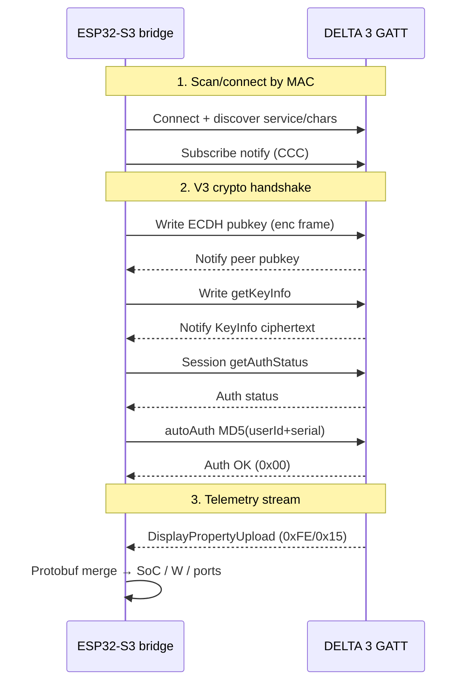
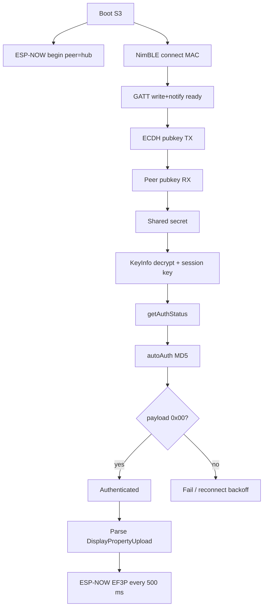

# EcoFlow DELTA 3 — BLE protocol (read-only bridge)

This document explains how `bridge_ecoflow_delta3` connects, authenticates, and
reads telemetry. **No control commands** are implemented (AC/DC/USB toggles stay
in the EcoFlow app).

---

## What is GATT?

**GATT** (Generic Attribute Profile) is the BLE layer that exposes device data as
a tree of **services** → **characteristics** → optional **descriptors**.

| Concept | Role on EcoFlow |
|---------|-----------------|
| Advertise | Station broadcasts a name like `EF-D3…` so scanners can find the MAC |
| Connect | Central (our ESP32-S3) opens a link to that MAC |
| Service UUID | EcoFlow service grouping RX/TX characteristics |
| Characteristic | One endpoint: we **write** commands, device **notifies** replies |
| Notify | Device pushes encrypted frames without us polling |

Think of GATT as a remote “file tree” over radio: we open the EcoFlow service,
subscribe to the notify characteristic, and write handshake bytes to the write
characteristic. Everything after that is EcoFlow’s proprietary framing, not
plain GATT values.

---

## Connection + authentication (V3)

1. **STA radio** for ESP-NOW channel (SSID scan, no AP join).
2. **NimBLE** connects to `ECOFLOW_BLE_ADDRESS` (prefer scan-found peer).
3. **ECDH** (SECP160r1 family): exchange public keys → shared secret.
4. **KeyInfo**: device sends material; bridge derives **session AES key**
   (also uses embedded `login_key.bin` from EcoFlow’s cloud login blob — fetched
   once on a PC, never committed).
5. **Auth token**: `MD5(USER_ID + DEVICE_SERIAL)` as 32 ASCII hex uppercase.
6. On success, device streams **session-encrypted** packets; version-19 payloads
   are XOR-obfuscated with `seq[0]` and may end with `0xBB 0xBB`.

### Address / command bytes (named in code)

| Constant | Value | Meaning |
|----------|-------|---------|
| `kAddrBridge` | `0x21` | Our side in session packets |
| `kAddrDevice` | `0x35` | Station MCU |
| `kCmdSetAuth` | `0x35` | Auth command set |
| `kCmdAuthStatus` | `0x89` | Ask auth status |
| `kCmdAutoAuth` | `0x86` | Send MD5 token |
| `kDisplayCmdSet/Id` | `0xFE` / `0x15` | DisplayPropertyUpload |
| `kCmdSetRetTime` | `0x52` | Device RTC request |

---

## Telemetry decode

`DisplayPropertyUpload` is a **protobuf** map of field numbers → floats/varints.
We merge partial frames (device often sends subsets). Field numbers are taken
from community pd335 maps (see credits). USB port **on** is derived from
`flow_info_qcusb*` / `flow_info_typec*` (bit1 set ⇒ on), same pattern as AC/DC.

ESP-NOW uplink magic `EF3P` (`EcoFlowEspNowProtocol.h`) carries the snapshot to
the M5 hub (encrypted when `ESPNOW_PMK` is set).

---

## Credits & references

This bridge is **unofficial** and for personal/local telemetry only.

| Project | What we learned |
|---------|-----------------|
| [alanstrok/ecoflow2nut-pibridge](https://github.com/alanstrok/ecoflow2nut-pibridge) | DELTA 3 pd335 path, DisplayPropertyUpload field map, NUT-oriented decode |
| [rabits/ef-ble-reverse](https://github.com/rabits/ef-ble-reverse) | V3 frame / crypto notes |
| [lollokara/ESP32-Ecoflow-BLE](https://github.com/lollokara/ESP32-Ecoflow-BLE) | ESP32 BLE bring-up patterns |
| [foxthefox/ioBroker.ecoflow-mqtt](https://github.com/foxthefox/ioBroker.ecoflow-mqtt) | Human-readable DELTA 3 property names |
| [tolwi/hassio-ecoflow-cloud](https://github.com/tolwi/hassio-ecoflow-cloud) | `flow_info_*` on/off semantics |

NimBLE: [h2zero/NimBLE-Arduino](https://github.com/h2zero/NimBLE-Arduino).

EcoFlow is a trademark of EcoFlow Inc. Protocol details may change with firmware.
